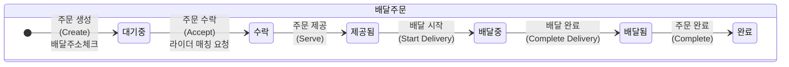
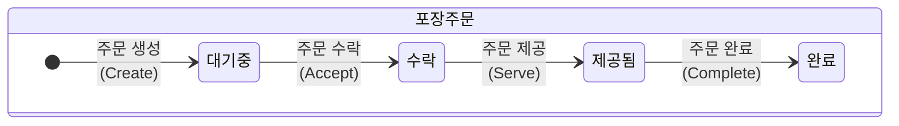
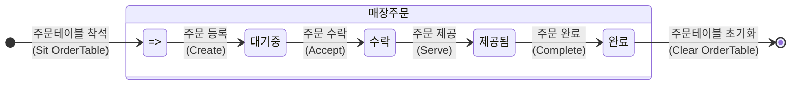

# 키친포스

## 퀵 스타트

```sh
cd docker
docker compose -p kitchenpos up -d
```

## 요구 사항

### 상품

- 상품을 등록할 수 있다.
- 상품의 가격이 올바르지 않으면 등록할 수 없다.
    - 상품의 가격은 0원 이상이어야 한다.
- 상품의 이름이 올바르지 않으면 등록할 수 없다.
    - 상품의 이름에는 비속어가 포함될 수 없다.
- 상품의 가격을 변경할 수 있다.
- 상품의 가격이 올바르지 않으면 변경할 수 없다.
    - 상품의 가격은 0원 이상이어야 한다.
- 상품의 가격이 변경될 때 메뉴의 가격이 메뉴에 속한 상품 금액의 합보다 크면 메뉴가 숨겨진다.
- 상품의 목록을 조회할 수 있다.

### 메뉴 그룹

- 메뉴 그룹을 등록할 수 있다.
- 메뉴 그룹의 이름이 올바르지 않으면 등록할 수 없다.
    - 메뉴 그룹의 이름은 비워 둘 수 없다.
- 메뉴 그룹의 목록을 조회할 수 있다.

### 메뉴

- 1 개 이상의 등록된 상품으로 메뉴를 등록할 수 있다.
- 상품이 없으면 등록할 수 없다.
- 메뉴에 속한 상품의 수량은 0 이상이어야 한다.
- 메뉴의 가격이 올바르지 않으면 등록할 수 없다.
    - 메뉴의 가격은 0원 이상이어야 한다.
- 메뉴에 속한 상품 금액의 합은 메뉴의 가격보다 크거나 같아야 한다.
- 메뉴는 특정 메뉴 그룹에 속해야 한다.
- 메뉴의 이름이 올바르지 않으면 등록할 수 없다.
    - 메뉴의 이름에는 비속어가 포함될 수 없다.
- 메뉴의 가격을 변경할 수 있다.
- 메뉴의 가격이 올바르지 않으면 변경할 수 없다.
    - 메뉴의 가격은 0원 이상이어야 한다.
- 메뉴에 속한 상품 금액의 합은 메뉴의 가격보다 크거나 같아야 한다.
- 메뉴를 노출할 수 있다.
- 메뉴의 가격이 메뉴에 속한 상품 금액의 합보다 높을 경우 메뉴를 노출할 수 없다.
- 메뉴를 숨길 수 있다.
- 메뉴의 목록을 조회할 수 있다.

### 주문 테이블

- 주문 테이블을 등록할 수 있다.
- 주문 테이블의 이름이 올바르지 않으면 등록할 수 없다.
    - 주문 테이블의 이름은 비워 둘 수 없다.
- 빈 테이블을 해지할 수 있다.
- 빈 테이블로 설정할 수 있다.
- 완료되지 않은 주문이 있는 주문 테이블은 빈 테이블로 설정할 수 없다.
- 방문한 손님 수를 변경할 수 있다.
- 방문한 손님 수가 올바르지 않으면 변경할 수 없다.
    - 방문한 손님 수는 0 이상이어야 한다.
- 빈 테이블은 방문한 손님 수를 변경할 수 없다.
- 주문 테이블의 목록을 조회할 수 있다.

### 주문

- 1개 이상의 등록된 메뉴로 배달 주문을 등록할 수 있다.
- 1개 이상의 등록된 메뉴로 포장 주문을 등록할 수 있다.
- 1개 이상의 등록된 메뉴로 매장 주문을 등록할 수 있다.
- 주문 유형이 올바르지 않으면 등록할 수 없다.
- 메뉴가 없으면 등록할 수 없다.
- 매장 주문은 주문 항목의 수량이 0 미만일 수 있다.
- 매장 주문을 제외한 주문의 경우 주문 항목의 수량은 0 이상이어야 한다.
- 배달 주소가 올바르지 않으면 배달 주문을 등록할 수 없다.
    - 배달 주소는 비워 둘 수 없다.
- 빈 테이블에는 매장 주문을 등록할 수 없다.
- 숨겨진 메뉴는 주문할 수 없다.
- 주문한 메뉴의 가격은 실제 메뉴 가격과 일치해야 한다.
- 주문을 접수한다.
- 접수 대기 중인 주문만 접수할 수 있다.
- 배달 주문을 접수되면 배달 대행사를 호출한다.
- 주문을 서빙한다.
- 접수된 주문만 서빙할 수 있다.
- 주문을 배달한다.
- 배달 주문만 배달할 수 있다.
- 서빙된 주문만 배달할 수 있다.
- 주문을 배달 완료한다.
- 배달 중인 주문만 배달 완료할 수 있다.
- 주문을 완료한다.
- 배달 주문의 경우 배달 완료된 주문만 완료할 수 있다.
- 포장 및 매장 주문의 경우 서빙된 주문만 완료할 수 있다.
- 주문 테이블의 모든 매장 주문이 완료되면 빈 테이블로 설정한다.
- 완료되지 않은 매장 주문이 있는 주문 테이블은 빈 테이블로 설정하지 않는다.
- 주문 목록을 조회할 수 있다.

## 용어 사전

### 인물

| 한글 용어 | 영어 용어       | 설명                       |
|-------|-------------|--------------------------|
| 사장님   | Store Owner | 키친포스를 사용하는 가게 사장님을 의미한다. |
| 고객님   | Customer    | 주문을 요청하는 사람을 의미한다.       |
| 배달기사님 | Rider       | 주문한 음식을 배달해주는 기사님을 의미한다. |


### 시스템

| 한글 용어      | 영어 용어                      | 설명                                                        |
|------------|----------------------------|-----------------------------------------------------------|
| 키친포스       | Kitchen Pos                | 상품과 메뉴를 관리하며 주문을 받는 시스템을 의미한다.                            |
| 배달대행업체     | Delivery Agency            | 배달기사님을 매칭해주는 업체를 의미한다.                                    |
| 비속어 탐지 시스템 | Profanity Detection System | 비속어가 포함되어 있는지 검사해주는 시스템을 의미한다.                            |
| 비속어        | Profanity                  | 욕설 또는 저속한 표현을 의미하며, 특정인에게 모욕감을 주거나 비하하는 표현이 포함된 단어를 의미한다. |


### 상품

| 한글 용어 | 영어 용어        | 설명                                  |
|-------|--------------|-------------------------------------|
| 상품    | Product      | 키친포스에서 음식, 음료, 서비스 형태의 단일 품목을 의미한다. |
| 상품 명  | Name         | 상품의 이름을 의미한다.                       |
| 상품 가격 | Price        | 상품의 가격을 의미한다.                       |
| 생성    | Create       | 상품을 생성한다.                           |
| 가격 변경 | Change Price | 생성된 상품의 가격을 변경한다.                   |


### 메뉴그룹

| 한글 용어  | 영어 용어      | 설명              |
|--------|------------|-----------------|
| 메뉴그룹   | Menu Group | 메뉴들을 특정 기준으로 분류한 집합을 의미한다. |
| 메뉴그룹 명 | Name       | 메뉴그룹의 이름을 의미한다. |
| 생성     | Create     | 메뉴그룹을 생성한다.     |


### 메뉴

| 한글 용어   | 영어 용어        | 설명                                        |
|---------|--------------|-------------------------------------------|
| 메뉴      | Menu         | 키친포스에서 주문할 수 있는 최소단위를 의미한다. 메뉴는 한 개 이상의 상품으로 구성된다. |
| 메뉴 명    | Name         | 메뉴의 이름을 의미한다.                             |
| 메뉴 가격   | Price        | 메뉴의 가격을 의미한다.                             |
| 메뉴 노출여부 | Displayed    | 해당 메뉴의 노출여부를 정할 수 있다. 노출과 숨김 두 가지 상태가 있다. |
| 메뉴구성상품  | Menu Product | 메뉴를 구성하는 상품과 수량 정보를 포함한다.                 |
| 생성      | Create       | 메뉴를 생성한다.                                 |
| 가격 변경   | Change Price | 생성된 메뉴의 가격을 변경한다.                         |
| 노출      | Display      | 생성된 메뉴를 노출한다.                             |
| 숨김      | Undisplay    | 생성된 메뉴를 숨긴다.                              |


### 주문테이블

| 한글 용어    | 영어 용어                   | 설명                                                      |
|----------|-------------------------|---------------------------------------------------------|
| 주문테이블    | Order Table             | 매장주문 고객을 관리하기 위해 사용하는 테이블을 의미한다.                        |
| 주문테이블 명  | Name                    | 주문테이블의 이름을 의미한다.                                        |
| 점유여부     | Occupied                | 주문테이블의 점유여부를 정할 수 있다. 점유중과 점유안함 두 가지 상태가 있다.            |
| 고객의 수    | Number of Guests        | 주문테이블을 이용중인 고객의 수를 의미한다.                                |
| 생성       | Create                  | 주문테이블을 생성한다. 테이블은 점유안함 상태이고 고객의 수는 0명이다.                |
| 착석       | Sit                     | 주문테이블을 점유중인 상태로 변경한다.                                   |
| 초기화      | Clear                   | 주문테이블을 초기화한다. 주문완료 상태에서 주문테이블은 점유안함 상태이고 고객의 수는 0명이 된다. |
| 고객의 수 변경 | Change Number of Guests | 주문테이블이 점유중인 상태에서 고객의 수를 변경할 수 있다.                       |


### 주문

| 한글 용어   | 영어 용어            | 설명                                                                                             |
|---------|------------------|------------------------------------------------------------------------------------------------|
| 주문      | Order            | 고객이 구매한 메뉴나 서비스를 의미한다.                                                                         |
| 주문생성시간  | Order Date Time  | 주문이 생성된 시간을 의미한다.                                                                              |
| 주문 아이템  | Order Line Item  | 주문을 구성하는 메뉴의 종류를 의미한다. 메뉴와 수량과 가격을 가진다.                                                        |
| 주문 유형   | Order Type       | 고객이 주문한 메뉴가 제공되는 유형을 의미한다. 주문 유형은 DELIVERY, TAKEOUT, EAT_IN 중 하나여야 한다.                         |
| 배달      | Delivery         | 고객이 주문한 메뉴를 배달대행업체를 통해 보내는 주문 유형이다.                                                            |
| 포장      | Takeout          | 고객이 주문한 메뉴를 포장해가는 주문 유형이다.                                                                     |
| 매장 내 식사 | Eat in           | 고객이 주문한 메뉴를 매장 내에서 식사하는 주문 유형이다.                                                               |
| 주문 상태   | Order Status     | 주문의 진행상황을 의미한다. 주문 상태는 WAITING, ACCEPTED, SERVED, DELIVERING, DELIVERED, COMPLETED 중에 하나여야 한다. |
| 주문 생성   | Create           | 주문을 생성하는 것을 의미한다.                                                                              |
| 대기중     | Waiting          | 주문이 생성되고 주문수락 전 대기 상태이다.                                                                       |
| 수락      | Accepted         | 주문이 수락되고 메뉴 조리를 시작하는 상태이다.                                                                     |
| 제공됨     | Served           | 매장은 주문 종류에 따라 조리가 완료된 음식을 제공하는 상태이다.                                                           |
| 배달 중    | Delivering       | 배달 주문일 때, 배달이 진행 중인 상태이다.                                                                      |
| 배달됨     | Delivered        | 배달 주문일 때, 배달이 완료된 상태이다.                                                                        |
| 완료      | Completed        | 주문이 최종적으로 완료된 상태이다.                                                                            |
| 배달 주소   | Delivery Address | 음식이 배달되어야 하는 주소를 의미한다.                                                                         |


## 모델링

### 상품(`Product`)
#### 속성
- 상품(`Product`)은 식별자, 이름(`name`), 가격(`price`)을 가진다.

#### 행위
- 상품(`Product`)을 생성(**create**)한다.
  - 이름(`name`)은 비워둘 수 없고, 비속어(profanity)가 포함될 수 없다.
    - 비속어 탐지 시스템(Profanity Detection System)을 통해서 이름에 비속어가 포함되지 않음(`false`)을 확인한다.
  - 가격(`price`)은 비워둘 수 없고, 0원 이상이어야 한다.
- 이미 생성된 상품(`Product`)의 가격을 변경(**change price**)한다.
  - 가격(`price`)은 비워둘 수 없고, 0원 이상이어야 한다.
  - 해당 상품(`Product`)을 포함하는 메뉴(`Menu`)의 가격이 메뉴구성상품들 가격의 총 합보다 크면 해당 메뉴(`Menu`)의 노출여부(`displayed`)는 숨김(`false`)로 변경된다.
    - 메뉴(`Menu`)와 상품(`Product`)의 자세한 [**가격 정책**](#가격정책)은 본문의 `메뉴구성상품 > 정책 > 가격정책`에서 확인할 수 있다.
- 모든 상품(`Product`)의 목록을 조회(**findAll**)할 수 있다.


### 메뉴구성상품(`MenuProduct`)
#### 속성
- 메뉴구성상품(`MenuProduct`)은 상품(`product`)과 수량(`quantity`)을 가진다.

#### 정책
##### 메뉴, 상품 그리고 메뉴구성상품의 관계
- 메뉴구성상품(`MenuProduct`)은 메뉴(`Menu`)에서 1개 이상 구성된다. 
  - 상품(`product`)은 이미 생성된 상품(`Product`) 중에서 반드시 1개만 가진다.
  - 수량(`quantity`)은 비워둘 수 없고, 0개 보다 커야한다. 한 상품당 개수를 의미한다.
    > 예) 메뉴 : 순살치킨
    >  - 메뉴구성상품(상품, 수량)        // 메뉴가 구성된 상품은 후라이드치킨, 양념치킨으로 2개이다.
    >    - 상품 1 : (후라이드 치킨, 1개) // 상품 1개에 대한 수량으로 관리된다.
    >    - 상품 2 : (양념 치킨, 2개)

    | 메뉴 : 순살치킨 | 상품(product) | 수량(quantity) |
        |-----------|-------------|--------------|
    | 메뉴구성상품 1  | 후라이드치킨     | 1개           |
    | 메뉴구성상품 2  | 양념치킨        | 2개           |

##### 가격정책
- 메뉴구성상품(`MenuProduct`)은 메뉴(`Menu`)와 관계있는 가격 정책을 따른다.
- '모든 메뉴구성상품(`MenuProduct`)의 "변경된 상품의 가격(`product price`) * 수량(`quantity`)"의 총 합'보다 <br>현재 메뉴의 가격(`menu price`)이 작거나 같아야 한다.
- 수식 : `현재 메뉴의 가격` <= `모든 메뉴구성상품의 (변경된 가격 * 수량)의 총 합`<br>
  >  - 예) **메뉴** : 순살치킨(후라이드 1개 + 양념치킨 1개)의 가격 = `30,000`원 | **상품** : 후라이드 가격 = `15,000`원, 양념치킨 가격 = `16,000`원
  >    - 변경 전 :
  >      - `30,000`원(현재 메뉴 가격) < `31,000`원 = 15,000 * 1 + 16,000 * 1 (메뉴구성상품의 가격의 총 합)
  >      - 가격 정책 만족하고, 현재 메뉴는 노출된 상태.
  >    - 변경 후 : 후라이드 가격을 `10,000`원으로 변경한다.
  >      - `30,000`원(현재 메뉴 가격) > `26,000`원 = **10,000** * 1 + 16,000 * 1 (변경 후 메뉴구성상품의 가격의 총 합)
  >      - 가격 정책을 만족하지 않으므로 이 메뉴는 숨겨진 상태.


### 메뉴그룹(`MenuGroup`)
#### 속성
- 메뉴그룹(`MenuGroup`)은 식별자, 이름(`name`)을 가진다.

#### 행위
- 메뉴그룹(`MenuGroup`)을 생성(**create**)한다.
  - 이름(`name`)은 비워둘 수 없다.
- 모든 메뉴그룹(`MenuGroup`)의 목록을 조회(findAll)할 수 있다.


### 메뉴(`Menu`)
#### 속성
- 메뉴(`Menu`)는 식별자, 이름(`name`), 가격(`price`), 노출여부(`displayed`), 메뉴그룹(`menuGroup`), 메뉴구성상품들(`menuProducts`)을 가진다.

#### 행위
- 메뉴(`Menu`)를 생성(**create**)한다.
  - 이름(`name`)은 비워둘 수 없고, 비속어(profanity)가 포함될 수 없다.
    - 비속어 탐지 시스템(Profanity Detection System)을 통해서 이름에 비속어가 포함되지 않음(`false`)을 확인한다.
  - 가격(`price`)은 비워둘 수 없고, 0원 이상이어야 한다.
  - 노출여부(`dispalyed`)는 노출(`true`)상태이거나 숨김(`false`)상태 중 선택한다.
  - 이미 생성된 메뉴그룹(`menuGroup`)에 반드시 1개 포함시켜야 한다.
    > - 예) "순살치킨"메뉴눈 "추천메뉴"라는 메뉴그룹에 포함된다.
  - 메뉴구성상품들(`menuProducts`)은 반드시 1개 이상 구성된다.
    - 같은 상품(`menuProduct product`)을 가지는 메뉴구성상품(`menuProduct`)은 두 번 이상 구성될 수 없다.
      > - 예) 3개의 [("양념치킨", 1개), ("양념치킨", 2개), (후라이드 치킨, 1개)] 메뉴구성상품들로 구성될 때, <br>"양념치킨"상품이 포함된 메뉴구성상품이 두 번 구성되게 할 수 없다.
    - 상품(`menuProduct product`)은 이미 생성된 상품(`Product`)에서 반드시 1개만 가진다.
    - 각 수량이 (`menuProduct quantity`) 0개 이상이여야 한다.
  - 메뉴구성상품들(`menuProducts`) 가격의 총 합보다 메뉴의 가격(`menu price`)이 작거나 같아야 한다.
    - 메뉴(`Menu`)와 메뉴구성상품(`MenuProduct`)의 자세한 [**가격 정책**](#가격정책)은 본문의 `메뉴구성상품 > 정책 > 가격정책`에서 확인할 수 있다.
- 이미 생성된 메뉴(`Menu`)의 가격을 변경(**change price**)한다.
  - 가격(`price`)은 비워둘 수 없고, 0원 이상이어야 한다.
  - 메뉴구성상품들(`menuProducts`) 가격의 총 합보다 변경된 메뉴의 가격(`menu price`)이 작거나 같아야 한다.
- 이미 생성된 메뉴(`Menu`)를 노출(**display**)한다.
  - 메뉴구성상품들(`menuProducts`) 가격의 총 합보다 메뉴의 가격(`menu price`)이 작거나 같아야 한다.
  - 노출여부(`displayed`)는 노출(`true`)상태로 변경한다.
- 이미 생성된 메뉴(`Menu`)를 숨긴(**undisplay**)다.
  - 노출여부(`displayed`)는 숨김(`false`)상태로 변경한다.
- 모든 메뉴(`Menu`)의 목록을 조회(**findAll**)할 수 있다.


### 주문테이블(`OrderTable`)
#### 속성
- 주문테이블(`OrderTable`)은 식별자, 이름(`name`), 고객의 수(`numberOfGuests`), 점유여부(`occupied`)를 가진다.

#### 행위
- 주문테이블(`OrderTable`)을 생성(**create**)한다.
  - 이름 (`name`)은 비워둘 수 없다.
  - 고객의 수(`numberOfGuests`)는 0명 이다.
  - 점유여부(`occupied`)는 점유안함(`false`)상태이다.
- 해당 주문테이블(`OrderTable`)은 착석(**sit**)되었다.
  - 점유여부(`occupied`)가 점유중(`true`)으로 변경한다.
- 해당 주문테이블(`OrderTable`)을 초기화(**clear**)되었다.
  - 해당 주문테이블`OrderTable`에 생성된 모든 주문(`Order`)의 주문 상태(`OrderStatus`)가 주문완료(`COMPLETED`) 이어야 한다.
  - 점유여부(`occupied`)가 점유안함(`false`)으로 변경한다.
  - 고객의 수(`numberOfGuests`)가 0으로 변경한다.
- 해당 주문테이블(`OrderTable`)의 고객의 수를 변경(**change numberOfGuests**)한다.
  - 변경할 고객의 수(`numberOfGuests`)는 0 이상 이어야 한다.
  - 해당 주문테이블(`OrderTable`)이 점유중(`true`)인 상태이어야 한다.
- 모든 주문테이블(`OrderTable`) 목록을 조회(**findAll**)한다.


### 주문 아이템(`OrderLineItem`)
#### 속성
- 주문 아이템(`OrderLineItem`)은 메뉴(`menu`), 수량(`quantity`), 가격(`price`)을 가진다.

#### 정책
- 주문 아이템(`OrderLineItem`)은 주문(`Order`)에서 1개 이상 구성된다.
- 메뉴(`menu`)는 이미 생성된 (`Menu`)이어야 한다.
- 메뉴(`menu`)는 노출(`true`)상태여야 한다.
- 수량(`quantity`)은 비워둘 수 없다.
- 고객님이 주문을 생성할 때, 주문 아이템의 가격(`price`)과 현재 키친포스에 생성된 메뉴(`Menu`)의 가격(`price`)은 같아야 한다.


### 주문(`Order`)
#### [공통]
##### 속성
- 주문(`Order`)은 식별자, 주문생성시간(`orderDateTime`), 주문유형(`type`), 주문상태(`status`), 주문 아이템(`OrderLineItem`)을 가진다.
  - 주문유형(`type`)은 배달 주문(`DELIVERY`), 포장 주문(`TAKEOUT`), 매장내식사 주문(`EAT_IN`)으로 나뉜다.
  - 주문상태(`status`)는 대기중(`WAITING`), 수락(`ACCEPTED`), 제공됨(`SERVED`), 완료(`COMPLETED`)의 공통 행위를 정의한다.

##### 행위
- 주문(`Order`)을 생성(**create**)한다.
  - 주문생성시간(`orderDateTime`)은 주문생성시점으로 생성된다.
  - 주문유형(`type`)은 비워둘 수 없다.
  - 주문상태(`status`)는 대기중(`WAITING`)이 된다.
  - 주문 아이템(`OrderLineItem`)은 1개 이상 있어야 한다.
    - 같은 메뉴(`OrderLineItem menu`) 종류를 가지는 주문 아이템(`OrderLineItem`)은 두 번 이상 구성될 수 없다.
    - 메뉴(`OrderLineItem menu`)는 이미 생성된 메뉴(`Menu`)여야 한다.
    - 모든 메뉴(`OrderLineItem menu`)의 노출여부(`displayed`)는 노출(`true`)여야 한다.
    - 모든 주문아이템 메뉴(`OrderLineItem menu`)의 가격(`price`)은 현재 메뉴(`Menu`)의 가격(`price`)과 같아야 한다.
- 주문(`Order`)을 수락(**accept**)한다.
  - 해당 주문(`Order`)의 상태(`status`)는 대기중(`WAITING`)이어야 한다.
  - 주문상태(`status`)는 수락(`ACCEPTED`)으로 변경된다. 
- 주문(`Order`)을 제공(**serve**)한다.
  - 해당 주문의 상태(`status`)가 수락(`ACCEPTED`)이어야 한다.
  - 주문상태(`status`)는 제공됨(`SERVED`)으로 변경된다.
- 주문(`Order`)을 완료(**complete**)한다.
  - 주문상태(`status`)는 완료(`COMPLETED`)로 변경된다.
- 모든 주문(`Order`) 목록을 조회(**findAll**)할 수 있다.

#### [배달 주문]
##### 속성
- 배달 주문은 공통 속성과 배달주소(`deliveryAddress`)를 가진다.
  - 주문유형(`type`)은 배달 주문(`DELIVERY`)이다.
  - 주문상태(`status`)는 대기중(`WAITING`) -> 수락(`ACCEPTED`) -> 제공됨(`SERVED`) -> 배달중(`DELIVERING`) -> 배달됨(`DELIVERED`) -> 완료(`COMPLETED`)의 순서를 가진다.


##### 행위
- 주문(`Order`)을 생성(**create**)한다.
  - 모든 메뉴(`OrderLineItem menu`)의 수량(`quantity`)은 0개 이상 주문해야 한다.
  - 배달주소(`deliveryAddress`)는 비워둘 수 없다.
- 해당 주문(`Order`)을 수락(**accept**)한다.
  - 배달대행업체(Delivery Agency)를 통해 배달 기사님(Rider) 매칭을 요청한다.
    - 요청 시 주문('Order')의 식별자와 배달주소(`deliveryAddress`)를 보낸다. 
    - 또, 모든 주문아이템 메뉴(`OrderLineItem menu`)의 가격(`price`) 총 합을 함께 보낸다.
- 사장님(Store Owner)은 배달 기사님(Rider)에게 음식을 제공(**serve**)한다.
- 주문(`Order`)을 배달시작(**startDelivery**)한다.
  - 해당 주문의 유형(`type`)은 배달주문(`DELIVERY`)이어야 한다.
  - 해당 주문의 상태(`status`)가 제공됨(`SERVED`)이어야 한다.
  - 주문상태(`status`)는 배달중(`DELIVERING`)으로 변경된다.
- 주문(`Order`)을 배달완료(**completeDelivery**)한다.
  - 해당 주문의 상태(`status`)가 배달중(`DELIVERING`)이어야 한다.
  - 주문상태(`status`)는 배달됨(`DELIVERED`)으로 변경된다.
- 주문(`Order`)을 완료(**complete**)한다.
  - 해당 주문의 상태(`status`)가 배달됨(`DELIVERED`)이어야 한다.

#### [포장 주문]
##### 속성
- 포장 주문은 공통 속성만 갖는다. 
  - 주문유형(`type`)은 포장 주문(`TAKEOUT`)이다.
  - 주문상태(`status`)는 대기중(`WAITING`) -> 수락(`ACCEPTED`) -> 제공됨(`SERVED`) -> 완료(`COMPLETED`)의 순서를 가진다.


##### 행위
- 주문(`Order`)을 생성(**create**)한다.
  - 모든 메뉴(`OrderLineItem menu`)의 수량(`quantity`)은 0개 이상 주문해야 한다.
- 주문(`Order`)을 수락(**accept**)한다.
- 사장님(Store Owner)은 포장 고객님(Customer)에게 음식을 제공(**serve**)한다.
- 주문(`Order`)을 완료(**complete**)한다.
  - 해당 주문의 상태(`status`)가 제공됨(`SERVED`)이어야 한다.


#### [매장내식사 주문]
##### 속성
- 매장내식사 주문은 공통 속성과 주문테이블(`orderTable`)을 가진다.
  - 주문유형(`type`)은 매장내식사 주문(`EAT_IN`)이다.
  - 주문상태(`status`)는 대기중(`WAITING`) -> 수락(`ACCEPTED`) -> 제공됨(`SERVED`) -> 완료(`COMPLETED`)의 순서를 가진다.


##### 행위
- 주문(`Order`)을 생성(**create**)한다.
  - 이미 생성된 주문테이블(`OrderTable`)의 점유여부(`occupied`)가 점유(`true`)상태 여야 한다.
- 주문(`Order`)을 수락(**accept**)한다.
- 사장님(Store Owner)은 주문 테이블(`OrderTable`)에 있는 매장 고객님(Customer)에게 음식을 제공(**serve**)한다.
- 주문(`Order`)을 완료(**complete**)한다.
  - 해당 주문의 상태(`status`)가 제공됨(`SERVED`)이어야 한다.
  - 해당 주문테이블(`OrderTable`)의 모든 주문(`Order`)의 상태(`status`)가 완료(`COMPLETED`)이면 주문 테이블을 초기화(clear)한다.
    - 변경할 고객의 수(`numberOfGuests`)는 0 이상 이어야 한다.
    - 해당 주문테이블(`OrderTable`)이 점유중(`true`)인 상태이어야 한다.
