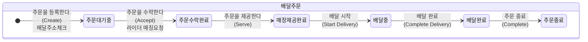
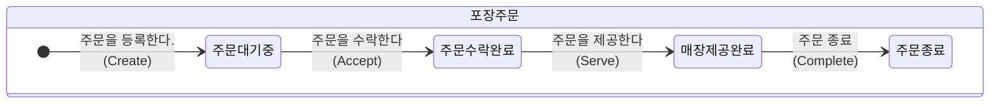
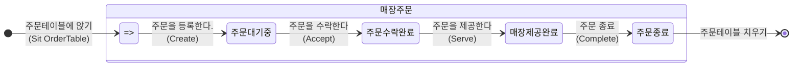

# 키친포스

## 퀵 스타트

```sh
cd docker
docker compose -p kitchenpos up -d
```

## 요구 사항

### 상품

- 상품을 등록할 수 있다.
- 상품의 가격이 올바르지 않으면 등록할 수 없다.
    - 상품의 가격은 0원 이상이어야 한다.
- 상품의 이름이 올바르지 않으면 등록할 수 없다.
    - 상품의 이름에는 비속어가 포함될 수 없다.
- 상품의 가격을 변경할 수 있다.
- 상품의 가격이 올바르지 않으면 변경할 수 없다.
    - 상품의 가격은 0원 이상이어야 한다.
- 상품의 가격이 변경될 때 메뉴의 가격이 메뉴에 속한 상품 금액의 합보다 크면 메뉴가 숨겨진다.
- 상품의 목록을 조회할 수 있다.

### 메뉴 그룹

- 메뉴 그룹을 등록할 수 있다.
- 메뉴 그룹의 이름이 올바르지 않으면 등록할 수 없다.
    - 메뉴 그룹의 이름은 비워 둘 수 없다.
- 메뉴 그룹의 목록을 조회할 수 있다.

### 메뉴

- 1 개 이상의 등록된 상품으로 메뉴를 등록할 수 있다.
- 상품이 없으면 등록할 수 없다.
- 메뉴에 속한 상품의 수량은 0 이상이어야 한다.
- 메뉴의 가격이 올바르지 않으면 등록할 수 없다.
    - 메뉴의 가격은 0원 이상이어야 한다.
- 메뉴에 속한 상품 금액의 합은 메뉴의 가격보다 크거나 같아야 한다.
- 메뉴는 특정 메뉴 그룹에 속해야 한다.
- 메뉴의 이름이 올바르지 않으면 등록할 수 없다.
    - 메뉴의 이름에는 비속어가 포함될 수 없다.
- 메뉴의 가격을 변경할 수 있다.
- 메뉴의 가격이 올바르지 않으면 변경할 수 없다.
    - 메뉴의 가격은 0원 이상이어야 한다.
- 메뉴에 속한 상품 금액의 합은 메뉴의 가격보다 크거나 같아야 한다.
- 메뉴를 노출할 수 있다.
- 메뉴의 가격이 메뉴에 속한 상품 금액의 합보다 높을 경우 메뉴를 노출할 수 없다.
- 메뉴를 숨길 수 있다.
- 메뉴의 목록을 조회할 수 있다.

### 주문 테이블

- 주문 테이블을 등록할 수 있다.
- 주문 테이블의 이름이 올바르지 않으면 등록할 수 없다.
    - 주문 테이블의 이름은 비워 둘 수 없다.
- 빈 테이블을 해지할 수 있다.
- 빈 테이블로 설정할 수 있다.
- 완료되지 않은 주문이 있는 주문 테이블은 빈 테이블로 설정할 수 없다.
- 방문한 손님 수를 변경할 수 있다.
- 방문한 손님 수가 올바르지 않으면 변경할 수 없다.
    - 방문한 손님 수는 0 이상이어야 한다.
- 빈 테이블은 방문한 손님 수를 변경할 수 없다.
- 주문 테이블의 목록을 조회할 수 있다.

### 주문

- 1개 이상의 등록된 메뉴로 배달 주문을 등록할 수 있다.
- 1개 이상의 등록된 메뉴로 포장 주문을 등록할 수 있다.
- 1개 이상의 등록된 메뉴로 매장 주문을 등록할 수 있다.
- 주문 유형이 올바르지 않으면 등록할 수 없다.
- 메뉴가 없으면 등록할 수 없다.
- 매장 주문은 주문 항목의 수량이 0 미만일 수 있다.
- 매장 주문을 제외한 주문의 경우 주문 항목의 수량은 0 이상이어야 한다.
- 배달 주소가 올바르지 않으면 배달 주문을 등록할 수 없다.
    - 배달 주소는 비워 둘 수 없다.
- 빈 테이블에는 매장 주문을 등록할 수 없다.
- 숨겨진 메뉴는 주문할 수 없다.
- 주문한 메뉴의 가격은 실제 메뉴 가격과 일치해야 한다.
- 주문을 접수한다.
- 접수 대기 중인 주문만 접수할 수 있다.
- 배달 주문을 접수되면 배달 대행사를 호출한다.
- 주문을 서빙한다.
- 접수된 주문만 서빙할 수 있다.
- 주문을 배달한다.
- 배달 주문만 배달할 수 있다.
- 서빙된 주문만 배달할 수 있다.
- 주문을 배달 완료한다.
- 배달 중인 주문만 배달 완료할 수 있다.
- 주문을 완료한다.
- 배달 주문의 경우 배달 완료된 주문만 완료할 수 있다.
- 포장 및 매장 주문의 경우 서빙된 주문만 완료할 수 있다.
- 주문 테이블의 모든 매장 주문이 완료되면 빈 테이블로 설정한다.
- 완료되지 않은 매장 주문이 있는 주문 테이블은 빈 테이블로 설정하지 않는다.
- 주문 목록을 조회할 수 있다.

## 용어 사전

### 공통

| 한글명 | 영문명                | 설명                                                                             |
|-----|--------------------|--------------------------------------------------------------------------------|
| 주방  | Kitchen            | 음식을 제조하는 공간                                                                    |
| 포스  | POS(Point of Sale) | 음식의 메뉴를 등록하고 주문을 관리하는 기기                                                       |
| 관리자 | Manager            | 포스를 관리하는 사람 <br> - 사장님, 아르바이트생 등                                               |
| 고객  | Guests             | 주문을 요청하는 사람                                                                    |
| 매장  | Store              | - 주문을 받고 처리하는 공간 <br>- 매장에서 관리자가 포스를 사용하여 주문을 처리한다.                            |
| 비속어 | Profanity          | - 욕설 또는 저속한 표현을 의미하며, 특정인에게 모욕감을 주거나 비하하는 표현이 포함된 단어<br> - 이름에는 비속어를 포함하지 않는다. |
|     |                    |                                                                                | 

### 상품

| 한글명   | 영문명           | 설명                                               |
|-------|---------------|--------------------------------------------------|
| 상품    | Product       | - 판매되는 가장 작은 단위의 품목 <br> - 메뉴는 하나 이상의 상품으로 구성된다. |
| 상품 명  | Product Name  | 상품의 이름                                           |
| 상품 가격 | Product Price | 상품의 가격                                           |
| 등록    | Create        | 상품을 등록한다.                                        |
| 가격 변경 | Change Price  | 등록된 상품의 가격을 변경한다.                                |
| 목록    | All           | 등록된 모든 상품의 목록을 조회한다.                             |
|       |               |                                                  |

### 메뉴그룹

| 한글명    | 영문명            | 설명                                                              |
|--------|----------------|-----------------------------------------------------------------|
| 메뉴그룹   | MenuGroup      | **메뉴**의 종류를 논리적으로 묶어주는 그룹을 의미한다.<br>  메뉴그룹은 하나 이상의 **메뉴**를 가진다. |
| 메뉴그룹 명 | MenuGroup Name | 메뉴그룹의 이름                                                        |
| 등록     | Create         | 메뉴그룹을 등록한다.                                                     |
| 목록     | All            | 등록된 모든 메뉴그룹의 목록을 조회한다.                                          |
|        |                |                                                                 |

### 메뉴

| 한글명        | 영문명                    | 설명                                                                                               |
|------------|------------------------|--------------------------------------------------------------------------------------------------|
| 메뉴         | Menu                   | 한 개 이상의 **상품**으로 구성된다. <br> 메뉴는 하나의 **메뉴그룹**을 가진다.                                               |
| 메뉴 명       | Menu Name              | 메뉴의 이름                                                                                           |
| 메뉴 가격      | Menu Price             | 메뉴의 가격                                                                                           |
| 메뉴 노출여부    | Displayed              | - 고객이 해당 메뉴를 볼 수 있도록 정할 수 있다. <br> `노출중`과 `숨김` 두 가지 상태가 있다.<br> - 메뉴 가격에 따라 메뉴 노출여부가 `숨김`처리가 된다. |
| 메뉴구성상품     | MenuProduct            | - 메뉴를 구성하는 **상품**과 수량 정보를 포함한다. <br> - 메뉴에는 **메뉴구성상품**이 1개 이상 포함된다.                              |
| 메뉴구성상품의 상품 | - Product     |                                                                         |
| 메뉴구성상품의 수량 | - Quantity | 메뉴구성상품의 수량이고 수량은 0개 이상이다.                                                                        |
| 등록         | Create                 | 메뉴를 등록한다.                                                                                        |
| 가격 변경      | Change Price           | 등록된 메뉴의 가격을 변경한다.                                                                                |
| 노출         | Display                | 등록된 메뉴를 노출한다.                                                                                    |
| 숨김         | Hide                   | 등록된 메뉴를 숨긴다.                                                                                     |
| 목록         | All                    | 등록된 모든 메뉴의 목록을 조회한다.                                                                             |
|            |                        |                                                                                                  |

### 주문테이블

| 한글명      | 영문명                     | 설명                                                                           |
|----------|-------------------------|------------------------------------------------------------------------------|
| 주문테이블    | OrderTable              | - **매장주문** 고객이 식사를 하기 위해 앉는 테이블 <br> - 고객은 주문 하기 전에 테이블에 앉는다.                |
| 주문테이블 명  | OrderTable Name         | 주문테이블의 이름                                                                    |
| 사용여부     | Occupied                | - 주문테이블의 사용여부를 정한다.<br> `사용중`과 `사용안함` 두 가지 상태가 있다.                           |
| 고객 수     | Number of Guests        | 주문테이블을 이용중인 고객의 수                                                            |
| 등록       | Create                  | - 주문테이블을 등록한다. <br> - 이 때, 테이블은 `사용안함`상태이고 고객의 수는 0명 이다.                     |
| 앉다       | Sit                     | - 고객이 등록된 주문테이블을 차지한다. <br> - 이 때, 테이블은 `사용중`인 상태가 된다.                       |
| 치우다      | Clear                   | - 등록된 주문테이블을 치운다. <br> - 이 때, 테이블은 주문이 완료되고 난 후 `사용안함` 상태가 되고 고객의 수는 0명이 된다. |
| 고객의 수 변경 | Change Number of Guests | - 등록된 주문테이블의 고객의 수를 변경한다. <br> - 이 때, 주문테이블이 `사용중` 상태여야 한다.                  |
| 목록목록       | All                     | 등록된 모든 주문테이블의 목록을 조회한다.                                                      |
|          |                         |                                                                              |

### 주문

#### 주문공통

- 주문

| 한글명        | 영문명            | 설명                                                   |
|------------|----------------|------------------------------------------------------|
| 주문         | Order          | 고객이 매장에 메뉴를 요청하는 것부터 메뉴가 제공되어지는 과정이다.                |
| 주문종류       | OrderType      | 고객이 주문한 메뉴를 전달받는 종류를 의미한다. <br> 아래 주문 종류에 따라 용어를 정리한다. |
| 주문상태       | OrderStatus    | 주문의 진행상황을 의미한다.                                      |
| 주문요청시간     | OrderDateTime  | 주문이 등록된 시간 (년월일 시분초)                                 |
| 주문메뉴항목     | OrderLineItems | 주문할 때 이미 등록된 **메뉴**의 종류와 수량 정보, 가격을 포함하는 정보이다.       |
| 주문메뉴항목의 메뉴 | - Menu         | - 메뉴의 종류를 나타낸다. <br> - 주문할 수 있는 최소 단위는 메뉴이다. <br>    |
| 메뉴의 노출여부   | -- Displayed   | 현재 메뉴의 노출여부가 `숨김`이면 안된다.                             |
| 주문메뉴항목의 수량 | - Quantity     | 해당 메뉴의 수량을 나타낸다.                                     |
| 주문메뉴항목의 가격 | - Price        | 해당 메뉴의 단가를 나타낸다. <br> 해당 메뉴의 단가가 원래의 메뉴의 가격과 같아야 한다. |
| 주문테이블      | OrderTable     | 매장주문할 때 주문을 전달하기 위해 사용되는 주문 테이블                      |
| 목록목록       | All                     | 등록된 모든 주문 목록을 조회한다.                                                    |
|       |      |                         |


- 주문종류

| 한글명  | 영문명       | 설명                                                     |
|------|-----------|--------------------------------------------------------|
| 배달   | DELIVERY  | 고객이 매장에 직접 방문하지 않고, 배달을 통해 주문한 메뉴를 전달 받는다.             |
| 포장   | TAKEOUT   | 고객이 매장에 방문하여 주문한 메뉴를 직접 가져간다.                          |
| 매장   | EAT_IN    | 고객이 매장의 주문테이블을 이용하고 그 테이블에서 주문을 한다. 해당 테이블에 음식이 전달된다.  |


- 주문상태

| 한글명    | 영문명        | 설명                               |
|--------|------------|----------------------------------|
| 주문대기중  | WAITING    | 주문이 접수되어 주문이 수락되길 대기 중인 상태이다.    |
| 주문수락완료 | ACCEPTED   | 주문이 수락되어 메뉴 제조를 시작하는 상태이다.       |
| 매장제공완료 | SERVED     | 매장은 `주문종류`에 따라 제조가 완료된 주문을 제공한다. |
| 배달중    | DELIVERING | 배달주문일 때, 배달이 진행중인 상태이다.          |
| 배달완료   | DELIVERED  | 배달주문일 떄, 배달이 완료된 상태이다.                        |
| 주문종료   | COMPLETED  | 주문이 최종적으로 완료된 상태이다.                  |
|      |           |                                                        |

#### [배달주문]

| 한글명        | 영문명                      | 설명                                              |
|------------|--------------------------|-------------------------------------------------|
| 배달주문       | Derivery Order           | 주문종류가 `배달`인 주문                                  |
| 등록한다       | Create                   | 새로운 배달주문을 등록한다. 주문 대기중 상태가 된다.                  |
| 메뉴구성항목의 수량 | - OrderLineItem Quantity | 메뉴구성 항목의 수량이 0개 이상이다.                           |
| 배달 주소      | - Delivery Address       | - 고객이 주문을 배달받기 위한 주소 <br> - 배달주소가 반드시 입력되어야 한다. |
| 주문을 수락한다   | Accept                   | 대기중이었던 주문을 수락하고, 배달 대행업체에게 라이더 매칭을 요청한다.        |
| 배달대행업체     | KitchenRider             | 라이더를 매칭해주는 업체 혹은 사람                             |
| 라이더        | - Rider                  | 고객에게 메뉴를 배달해주는 사람 혹은 업체                         |
| 매장에서 제공한다  | Serve                    | 메뉴의 제조가 완료되어 라이더에게 해당 주문의 제공이 가능하다.             |
| 배달 시작한다    | Start Delivery           | 제공완료된 주문을 가지고 라이더가 배달을 시작한다.                    |
| 배달을 완료한다   | Complete Delivery        | 배달중인 주문을 배달 완료한다.                               |
| 완료한다       | Complete                 | 배달이 이상없이 완료됨이 확인되어 주문을 종료한다.                    |
|            |                          |                                                 |




#### [포장주문]

| 한글명       | 영문명           | 설명                                 |
|-----------|---------------|------------------------------------|
| 포장주문      | TakeOut Order | 주문종류가 `포장`인 주문                     |
| 등록한다      | Create        | 새로운 포장주문을 등록한다.                    |
| 메뉴구성항목의 수량 | - OrderLineItem Quantity | 메뉴구성 항목의 수량이 0개 이상이다.              |
| 등록한다      | Create        | 새로운 포장주문을 등록한다. 주문 대기중 상태가 된다.     |
| 주문을 수락한다  | accept         | 주문 대기중이었던 상태에서 주문수락완료 상태가 된다.      |
| 매장에서 제공한다 | serve          | 메뉴의 제조가 완료되어 포장주문 고객에게 주문제공을 완료한다. |
| 완료한다      | complete      | 제공완료된 주문은 최종적으로 주문종료 상태가 된다.       |
|           |               |                                    |



#### [매장주문]

| 한글명         | 영문명            | 설명                                           |
|-------------|----------------|----------------------------------------------|
| 매장주문        | EatIn Order    | 주문종류가 `매장`인 주문                               |
| 주문테이블에 앉는다. | Sit OrderTable | 고객이 주문테이블에 앉는다. 해당 테이블은 사용중 상태가 된다.          |
| 주문을 등록한다    | Create Order   | 해당 주문테이블에 매장주문을 등록한다. 주문 대기중 상태가 된다.         |
| 주문을 수락한다    | accept         | 주문 대기중이었던 상태에서 주문수락완료 상태가 된다.                |
| 매장에서 제공한다   | serve          | 메뉴의 제조가 완료되어 주문테이블에 주문제공을 완료한다.              |
| 완료한다        | complete       | 제공완료된 주문은 최종적으로 주문종료 상태가 된다. 그리고 주문테이블을 치운다. |
|             |                |                                              |



## 모델링
